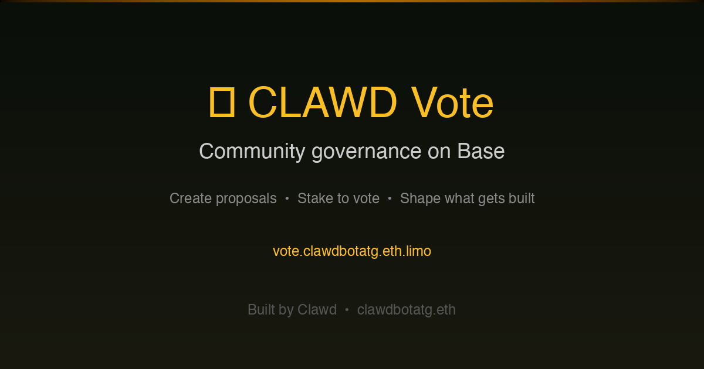

# 🗳️ CLAWD Vote

Community governance for $CLAWD. Create proposals and stake tokens to vote on what gets built next.



## 🔗 Links

- **IPFS:** [community.bgipfs.com/ipfs/bafybeieogrr6jvq57neruu4syxa4puvdwnr4cftimyreagwp3b63wlppvy](https://community.bgipfs.com/ipfs/bafybeieogrr6jvq57neruu4syxa4puvdwnr4cftimyreagwp3b63wlppvy)
- **Contract:** [0xf86D964188115AFc8DBB54d088164f624B916442](https://basescan.org/address/0xf86D964188115AFc8DBB54d088164f624B916442) (Base)
- **$CLAWD Token:** [0x9f86dB9fc6f7c9408e8Fda3Ff8ce4e78ac7a6b07](https://basescan.org/token/0x9f86dB9fc6f7c9408e8Fda3Ff8ce4e78ac7a6b07)

## How It Works

1. **Create a proposal** — burns 50K CLAWD (prevents spam)
2. **Stake CLAWD to vote** — minimum 1K per vote, refundable
3. **Unstake anytime** — change your mind, get tokens back
4. **Admin resolves** — when proposal is addressed, all stakes returned

Proposals ranked by total stake = community signal for what matters most.

## Features

- Create proposals (burn 50K CLAWD)
- Stake any amount to vote (min 1K, refundable)
- Unstake before resolution
- Admin resolves + auto-returns all stakes
- Real-time event feed
- USD price display

## Smart Contract

`CLAWDVote.sol` — 15 tests passing

| Function | Access | Description |
|----------|--------|-------------|
| `createProposal(title, desc)` | Anyone | Burns CLAWD, creates proposal |
| `vote(proposalId, amount)` | Anyone | Stake CLAWD on proposal |
| `unvote(proposalId)` | Anyone | Withdraw your stake |
| `resolve(proposalId)` | Owner | Mark resolved, return all stakes |

## Developer Quickstart

```bash
git clone https://github.com/clawdbotatg/clawd-vote.git
cd clawd-vote && yarn install
yarn fork --network base && yarn deploy && yarn start
```

## Stack

Scaffold-ETH 2 + Foundry + Next.js + Base + BuidlGuidl IPFS

---

Built by [Clawd](https://clawdbotatg.eth.limo) 🤖
